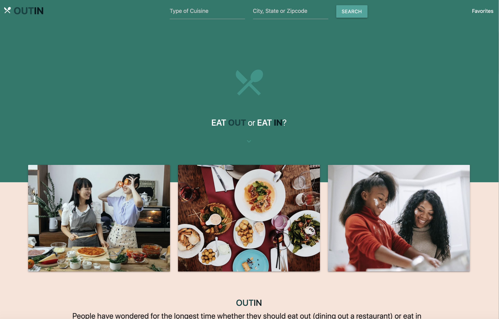
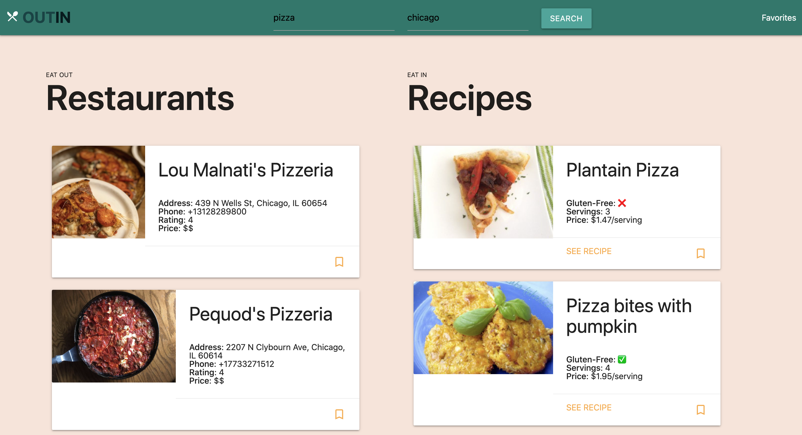

# Outin

## Description
An application that allows users to search for restaurants or recipes near their area or an area of their choosing. Enter a restaurant name or type of food in the left search bar, and a location on the right one, and voila, your results are there! You can choose to add any of the results to your favorites page. When you do, go to the favorites page and see your favorited restaurants/recipes all there.

## User Story
As a food connoisseur
I can display a list of local restaurants and recipes
Ss that I can decide whether to eat out or make my own food.

## Usage
This app uses local storage on your web browser to save your favorite restaurants/recipes. Materialize styling library was used for styling. Spoonacular API used for recipes, and Yelp API used for restaurants. No npm packages required. 

## Scnreenshots

-------------------------------------------------------------------------------------------------------------------------------------------------------------------

## Contributors/maintainers:
 * Armin - https://github.com/armin-ch/
 * Dia - https://github.com/diaseu/
 * Michael - https://github.com/DeviantSchemist/

## Deployment

This application is deployed to Github Pages. Click [here](https://deviantschemist.github.io/Project1/) to be redirected to the deployed site.
